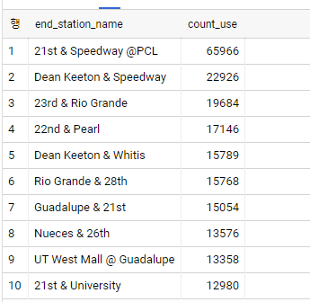

# BigQuery ML Challenge (Austin Bike) 

## Challenge 

공공데이터, Austin Bike를 이용하여 사용자들의 예상 이용시간의 평균 구하시오.

Model1의 우선 필수 항목
```
시작 스테이션, 시작 스테이션의 위치, 요일
```
Model2의 우선 필수 항목
```
시작 스테이션 , 가입자 유형, 출발시간
```
* training dataset는 2018년도,  validation dataset 2019년도 DataSet 사용

---- 
## Exploring the dataset

이용시간에 대한 분포

아래의 결과를 보면 평균과 표준편차가 큰것으로 보아 데이터가 분포가 좋지 않을것으로 예상.
```
SELECT
 MIN(t.duration_minutes) as minvalue,
 PERCENTILE_CONT(x, 0.5) OVER() AS median,
 STDDEV_POP(t.duration_minutes)  as `STDDEV_POP`,
 AVG(t.duration_minutes) as avarage,
 MAX(t.duration_minutes) as maxValue,
from  `bigquery-public-data.austin_bikeshare.bikeshare_trips` t
WHERE
  t.start_time >= '2018-01-01'
  AND t.start_time <= '2018-12-31'
  AND t.duration_minutes > 0
```


TOP10 Common Start_station
```
SELECT
t.start_station_name,
count(t.trip_id) count_use
from  `bigquery-public-data.austin_bikeshare.bikeshare_trips` t

WHERE
  t.start_time >= '2018-01-01'
  AND t.start_time <= '2018-12-31'
  AND t.duration_minutes > 0
group by t.start_station_name
order by count_use desc
limit 10
```


Top 10 Common Destination Stations
```

SELECT
t.end_station_name,
count(t.trip_id) count_use
from  `bigquery-public-data.austin_bikeshare.bikeshare_trips` t

WHERE
  t.start_time >= '2018-01-01'
  AND t.start_time <= '2018-12-31'
  AND t.duration_minutes > 0
group by t.end_station_name
order by count_use desc
limit 10

```



Top 10 Most Popular Routes with average Druation

결과를 확인하였을때 사용자의 반 이상이 9~24분이내로 사용하는것을 확인 가능하다.
```
SELECT
t.start_station_name,
t.end_station_name,
count(t.trip_id) count_use,
(sum(t.duration_minutes)/count(t.trip_id)) avg_duration
from  `bigquery-public-data.austin_bikeshare.bikeshare_trips` t

WHERE
  t.start_time >= '2018-01-01'
  AND t.start_time <= '2018-12-31'
  AND t.duration_minutes > 0
group by t.start_station_name,t.end_station_name 
order by count_use desc
limit 10

```


Model1을 만들기 전에 시작 스테이션과, 스테이션의 관계를 확인하기 위해 아래과 같이 조회한다. 확인 결과 start_station_id, start_station_name, location은 1:1:1로 매칭한다. 학습시에 이 중 하나의 컬럼만 사용하면 될거 같습니다. 

```
SELECT
  t.start_station_id,
  t.start_station_name,
  st.location
FROM
  `bigquery-public-data.austin_bikeshare.bikeshare_trips` t
JOIN
  `bigquery-public-data.austin_bikeshare.bikeshare_stations` st
ON
  st.station_id = t.start_station_id
WHERE
  t.start_time >= '2018-01-01'
  AND t.start_time <= '2018-12-31'
  AND t.duration_minutes > 0
GROUP BY
  t.start_station_id,
  t.start_station_name,
  st.location
ORDER BY
  t.start_station_id

```


요일에 따른 사용자의 빈도수를 아래의 데이터를 확인해 봅니다. 

```
SELECT

count(t.trip_id) as use_count
, FORMAT_DATE('%A', DATE(t.start_time) ) AS weekday_name
, sum(t.duration_minutes)/ count(t.trip_id) as avg_duration

from  `bigquery-public-data.austin_bikeshare.bikeshare_trips` t
WHERE
  t.start_time >= '2018-01-01'
  AND t.start_time <= '2018-12-31'
  AND t.duration_minutes > 0
  group by  weekday_name
  order by  use_count desc
```


Model2을 만들기 전에 subcribe 종류에 대하여 한번 데이터를 확인 합니다. 
학습시에는 null Data를 걸러주는것이 좋을거 같습니다.
```
SELECT
t.subscriber_type,
count(t.trip_id) as use_count
, sum(t.duration_minutes)/ count(t.trip_id) as avg_duration

from  `bigquery-public-data.austin_bikeshare.bikeshare_trips` t
WHERE
  t.start_time >= '2018-01-01'
  AND t.start_time <= '2018-12-31'
  AND t.duration_minutes > 0
  group by  t.subscriber_type
  order by  use_count desc
```


# Creat Model

사용자들의 이용시간(수치)을 예측함으로 linear_regration 사용

model_1
* training dataset는 2018년도,  validation dataset 2019년도 DataSet 사용

```
CREATE OR REPLACE MODEL
  austinBike.expect_duration_model_1 OPTIONS (model_type='linear_reg',
    labels=['duration_minutes']) AS
SELECT
  t.start_station_name,
  st.location AS start_station_location,
  t.duration_minutes -- label,
  FORMAT_DATE('%A', DATE(t.start_time) ) AS weekday
FROM
  `bigquery-public-data.austin_bikeshare.bikeshare_trips` t
JOIN
  `bigquery-public-data.austin_bikeshare.bikeshare_stations` st
ON
  st.station_id = t.start_station_id
WHERE
  t.start_time >= '2018-01-01'
  AND t.start_time < '2020-01-01'
  AND t.duration_minutes > 0

```
학습결과


validation
```
SELECT
  SQRT(mean_squared_error) AS rmse,
  *
FROM
  ML.EVALUATE(MODEL austinBike.expect_duration_model_1,
    (
    SELECT
      t.start_station_name,
      st.location AS start_station_location,
      t.duration_minutes -- label,
      FORMAT_DATE('%A', DATE(t.start_time) ) AS weekday
    FROM
      `bigquery-public-data.austin_bikeshare.bikeshare_trips` t
    JOIN
      `bigquery-public-data.austin_bikeshare.bikeshare_stations` st
    ON
      st.station_id = t.start_station_id
    WHERE
      t.start_time >= '2019-01-01'
      AND t.start_time < '2020-01-01'
      AND t.duration_minutes > 0 ))

```

* rmse = (예상값 - 실제값)^2/root(n)  한 값으로  일반적으로 직관적인 오차의 평균 (예상값 - 실제값)/n 한것보다 
나누는 크기가 작으므로 오차 더욱 강조되는 효과를 가질수있다. 그렇기에 오차를 판별하기에 많이 참조 된다.

model_2

```
CREATE OR REPLACE MODEL
  austinBike.expect_duration_model_2 OPTIONS (model_type='linear_reg',
    labels=['duration_minutes']) AS

SELECT
  t.subscriber_type,
  EXTRACT(MONTH
  FROM
    DATETIME(t.start_time)) AS month,
  EXTRACT(HOUR
  FROM
    DATETIME(t.start_time)) AS hour,
  t.start_station_id,
  t.end_station_id,
  t.duration_minutes,
  FORMAT_DATE('%A', DATE(t.start_time) ) AS weekday_name
FROM
  `bigquery-public-data.austin_bikeshare.bikeshare_trips` t
WHERE
  t.start_time >= '2018-01-01'
  AND t.start_time < '2019-01-01'
  AND t.duration_minutes > 0
  AND t.subscriber_type IS NOT NULL

```

validation
```
SELECT
  SQRT(mean_squared_error) AS rmse,
  *
FROM
  ML.EVALUATE(MODEL austinBike.expect_duration_model_2,
    (
    SELECT
      t.subscriber_type,
      EXTRACT(MONTH
      FROM
        DATETIME(t.start_time)) AS month,
      EXTRACT(HOUR
      FROM
        DATETIME(t.start_time)) AS hour,
      t.start_station_id,
      t.end_station_id,
      t.duration_minutes,
      FORMAT_DATE('%A', DATE(t.start_time) ) AS weekday_name
    FROM
      `bigquery-public-data.austin_bikeshare.bikeshare_trips` t
    WHERE
      t.start_time >= '2019-01-01'
      AND t.start_time < '2020-01-01'
      AND t.duration_minutes > 0
      AND t.subscriber_type IS NOT NULL ) 
      )

```


조금 더 학습 데이터에서 아웃스텐딩을 제거 및 필드 추가 후 학습을 진행해보겠습니다. 

## Retranning 


```
CREATE OR REPLACE MODEL
  austinBike.expect_duration_model_2 OPTIONS (model_type='linear_reg',
    labels=['duration_minutes']) AS

    SELECT
      t.subscriber_type,
      EXTRACT(MONTH
      FROM
        DATETIME(t.start_time)) AS month,
      EXTRACT(HOUR
      FROM
        DATETIME(t.start_time)) AS hour,
      --t.start_station_id,
      st.latitude as start_latitude,
      st.longitude as start_longitude,
      --t.end_station_id,
      et.latitude as end_latitude,
      et.longitude as end_longitude,

      t.duration_minutes,
      FORMAT_DATE('%A', DATE(t.start_time) ) AS weekday_name
    FROM
    `bigquery-public-data.austin_bikeshare.bikeshare_trips` t
    ,`bigquery-public-data.austin_bikeshare.bikeshare_stations` st
    ,`bigquery-public-data.austin_bikeshare.bikeshare_stations` et
    WHERE
      t.start_time >= '2018-01-01'
      AND t.start_time < '2019-01-01'
      AND t.duration_minutes > 0
      AND t.subscriber_type IS NOT NULL 
      AND CAST ( t.start_station_id AS STring) != CAST ( t.end_station_id AS STring) -- 출발스테이션과 종료스테이션이 같은경우
      AND duration_minutes < 215-- (평균 + 2*표준편차)
      and st.station_id = t.start_station_id
      and CAST( et.station_id AS STring)= t.end_station_id

```

validation
```
SELECT
  SQRT(mean_squared_error) AS rmse,
  *
FROM
  ML.EVALUATE(MODEL austinBike.expect_duration_model_2,
    (
    SELECT
      t.subscriber_type,
      EXTRACT(MONTH
      FROM
        DATETIME(t.start_time)) AS month,
      EXTRACT(HOUR
      FROM
        DATETIME(t.start_time)) AS hour,
     -- t.start_station_id,
      st.latitude as start_latitude,
      st.longitude as start_longitude,
     -- t.end_station_id,
      et.latitude as end_latitude,
      et.longitude as end_longitude,

      t.duration_minutes,
      FORMAT_DATE('%A', DATE(t.start_time) ) AS weekday_name
    FROM
    `bigquery-public-data.austin_bikeshare.bikeshare_trips` t
    ,`bigquery-public-data.austin_bikeshare.bikeshare_stations` st
    ,`bigquery-public-data.austin_bikeshare.bikeshare_stations` et
    WHERE
      t.start_time >= '2018-01-01'
      AND t.start_time < '2019-01-01'
      AND t.duration_minutes > 0
      AND t.subscriber_type IS NOT NULL --AND CAST ( t.start_station_id AS STring) != CAST ( t.end_station_id AS STring) -- 출발스테이션과 종료스테이션이 같은경우
      and t.duration_minutes < 215-- (평균 + 2*표준편차)
      and st.station_id = t.start_station_id
      and CAST( et.station_id AS STring)= t.end_station_id
      ) )

```


----

## Task : 평균 주행 기간 예측
```
위 두 모델중 2번 모델을 이용하여, 
이용자 중 subscriber type이 Single Trip이고  가장 많이 이용 된 스테이션에서의 사용시간의 평균을 구하시요.
```

2019 가장 많이 사용 된 Station
```
SELECT
  t.start_station_name,
  COUNT(t.trip_id) as use_count
FROM
  `bigquery-public-data.austin_bikeshare.bikeshare_trips` t
GROUP BY
  t.start_station_name
  order by  use_count desc 
  limit 1

```
2019 가장 사용이 빈번한 스테이션 : 21st & Speedway @PCL


예측값 확인
```
SELECT
  *
FROM
  ML.PREDICT(MODEL austinBike.expect_duration_model_2,
    (
    SELECT
      t.subscriber_type,
      EXTRACT(MONTH
      FROM
        DATETIME(t.start_time)) AS month,
      EXTRACT(HOUR
      FROM
        DATETIME(t.start_time)) AS hour,
      --t.start_station_id,
      st.latitude as start_latitude,
      st.longitude as start_longitude,
      --t.end_station_id,
      et.latitude as end_latitude,
      et.longitude as end_longitude,

      t.duration_minutes,
      FORMAT_DATE('%A', DATE(t.start_time) ) AS weekday_name
    FROM
    `bigquery-public-data.austin_bikeshare.bikeshare_trips` t
    ,`bigquery-public-data.austin_bikeshare.bikeshare_stations` st
    ,`bigquery-public-data.austin_bikeshare.bikeshare_stations` et
    WHERE
      t.start_time >= '2019-01-01'
      AND t.start_time < '2020-01-01'
      AND t.duration_minutes > 0
      AND t.subscriber_type IS NOT NULL
      AND CAST ( t.start_station_id AS STring) != CAST ( t.end_station_id AS STring) -- 출발스테이션과 종료스테이션이 같은경우
     AND duration_minutes < 215 -- (평균 + 2*표준편차)
           and st.station_id = t.start_station_id
      and CAST( et.station_id AS STring)= t.end_station_id
      ) )
```

예측평균 시간 

```

SELECT
  B.subscriber_type,
  AVG(B.duration_minutes) as avg_duration
FROM
  ML.PREDICT(MODEL `austinBike.expect_duration_model_2`,
    (
SELECT
      t.subscriber_type,
      EXTRACT(MONTH
      FROM
        DATETIME(t.start_time)) AS month,
      EXTRACT(HOUR
      FROM
        DATETIME(t.start_time)) AS hour,
      --t.start_station_id,
      st.latitude as start_latitude,
      st.longitude as start_longitude,
      --t.end_station_id,
      et.latitude as end_latitude,
      et.longitude as end_longitude,

      t.duration_minutes,
      FORMAT_DATE('%A', DATE(t.start_time) ) AS weekday_name
    FROM
    `bigquery-public-data.austin_bikeshare.bikeshare_trips` t
    ,`bigquery-public-data.austin_bikeshare.bikeshare_stations` st
    ,`bigquery-public-data.austin_bikeshare.bikeshare_stations` et
    WHERE
      t.start_time >= '2019-01-01'
      AND t.start_time < '2020-01-01'
      AND t.duration_minutes > 0
      AND t.subscriber_type IS NOT NULL
      AND CAST ( t.start_station_id AS STring) != CAST ( t.end_station_id AS STring) -- 출발스테이션과 종료스테이션이 같은경우
     AND duration_minutes < 215 -- (평균 + 2*표준편차)
           and st.station_id = t.start_station_id
      and CAST( et.station_id AS STring)= t.end_station_id
      and t.start_station_name = '21st & Speedway @PCL'
      --and t.subscriber_type = 'Single Trip'
      )
)B
group by B.subscriber_type

```